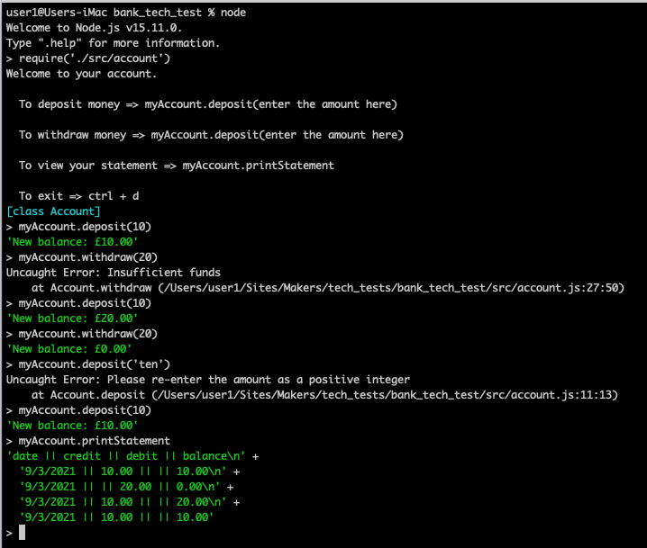
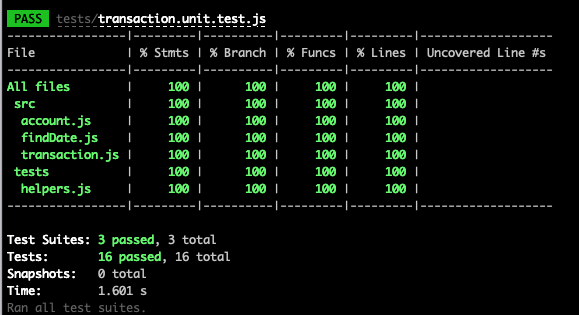

# Bank Tech Test

## Specification
### Requirements
- You should be able to interact witih your code via the JS concole
- Deposits
- Withdrawals
- Account statement (data, amount, balance) printing
- Data is stored in memory (not in a database)

## How to run 

First, clone this repo. Then:
```
> npm install
> node
> require('./src/account)
> To deposit money => myAccount.deposit(enter the amount here)
> To withdraw money => myAccount.deposit(enter the amount here)
> To view your statement => myAccount.printStatement
> To exit => cmd + c
```

## The App


## How to run tests

In the command line, run:
```
npm run test
```

You should see *100% of tests* passed with *100% coverage*.


## User Stories
```
As a customer
So I can save money in my bank
I'd like to be able to deposit money into my account
```
```
As a customer
So I can take my money out of my account
I'd like to be able to make withdrawals from my account
```
```
As a customer
So I can keep track of my money in my account
I'd like to be able to view a statement that shows the deposits, withdrawals, the dates of them and the balance
```

## Acceptance Criteria
*Given* a client makes a deposit of 1000 on 10-01-2012
*And* a deposit of 2000 on 13-01-2012
*And* a withdrawal of 500 on 14-01-2012
*When* she prints her bank statement
*Then* she would see
```
date || credit || debit || balance
14/01/2012 || || 500.00 || 2500.00
13/01/2012 || 2000.00 || || 3000.00
10/01/2012 || 1000.00 || || 1000.00
```

## My approach
I started this task by breaking everything down into the most simple of steps and using a red green refactor process to individually solve each step. E.g. I started the deposit as a method that just passes a number into the balance and then with TDD worked it up to creating a more complex hash that passed the information into the Transactions class and stored that in a transactions array. 

## Planning
### Date
Date should be shown as the acceptance criteria above.
So today the date is 8th March 2021 and so should be shown as
```8/3/2021```

### Amount
The amount deposited or withdrawn should be specified with 2 decimal places and saved as a type and amount to make printing the statements easier down the line
```type: 'debit', amount: 6000```

### Transactions
Transactions should produce a hash that contains the information about:
- the date
- whether it is credit or debit
- the amount
- the balance at the time

e.g 
```
account.deposit(500)
account.transactions
=> [{date: 01/01/2000, type: credit, amount: 500, balance: 500}]
```
This will make it easier down the line to pull out the information for the statement

### Unhappy Paths
- user could enter not an integer into withdraw and deposit
```
myAccount.deposit('ten')
```
- user could enter a negative integer
```
myAccount.deposit(-10)
```
### Code Layout
I specifically designed the code so that at the top would be all the code that the user has access to, and beneath that is all the private methods that are needed for the app to function but I do not want users to be able to access so they can't edit their balance or any transactions.

I also refactored all of my classes so that they are only single responsibility to ensure that the code is as easy to read as possible, as well as removing any of my comments I added when building the code so they don't distract when reading the code. 

## What could be improved
Next steps:
- giving this a GUI would stop any chances of the unhappy paths as if I only gave users buttons to press then they couldn't input anything that would crash the app
